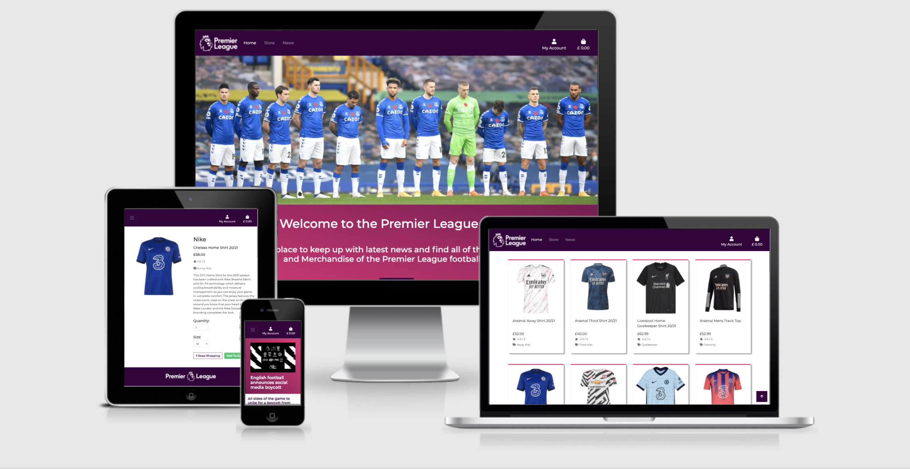
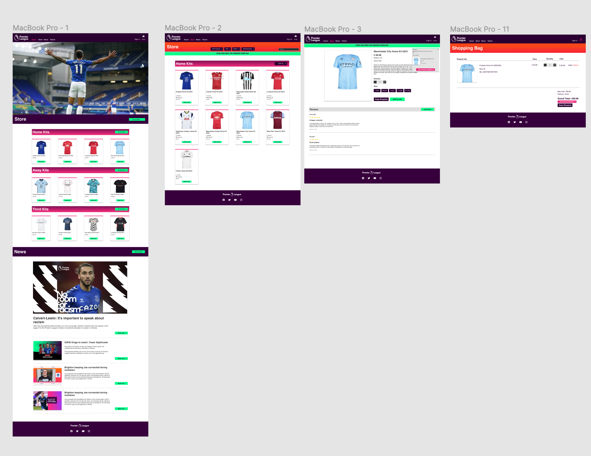
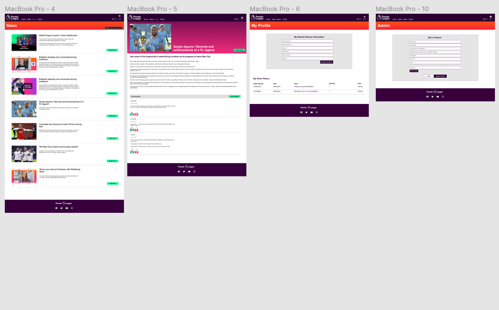
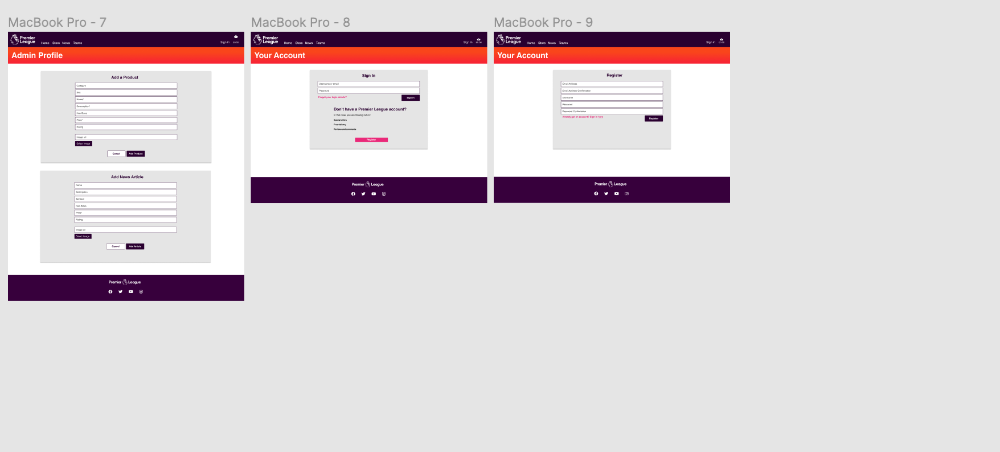
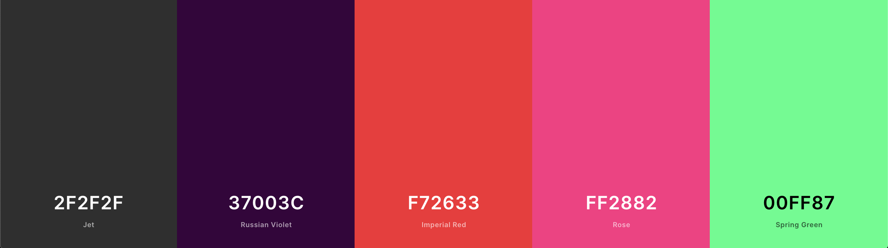
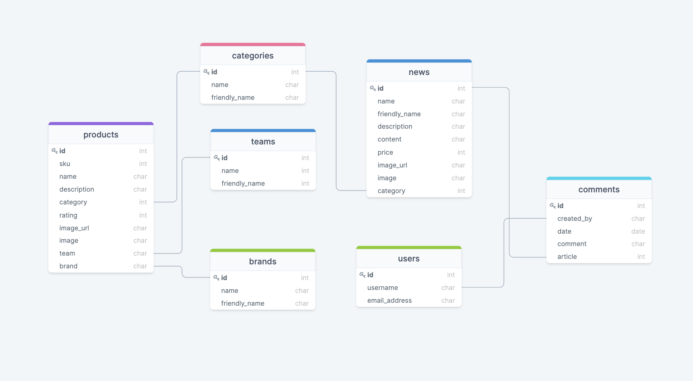
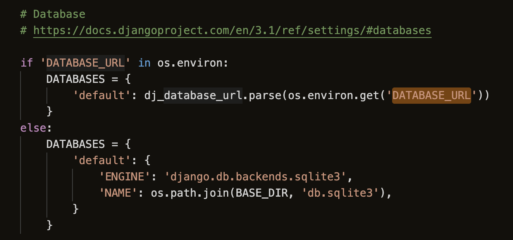

# MS4 - Premier League Store

[View the deployed project here.](https://premier-league-store-ms4.herokuapp.com/)
***



For my final milestone project for the Code Institute Diploma in Software Development I created the Premier League Store. This is an app that allows fans of the Premier League to buy foootball kits and merchandise from the teams that play in the league, as well as keeping up to date with the latest news from the Premiership. 
Users are able to to filter the products by team so they can easily find the products of their favourite team and they can also leave comments on the news articles so that they can express they feeling on whats happening. 
The store owner has the ability to create, read, update and delete products and news articles enabling them to keep the store maintained and up to date. The website is fully responsive accross all devices ensuring there are no users unable to enjoy it.

## Table Of Contents

- [User Experience](#User-Experience)
    - [User Stories](#User-Stories)
    - [Project Stakeholders](#Project-Stakeholders)
    - [New users](#New-users)
    - [Returning Users](#Returning-Users)
    - [Mobile user](#Mobile-user)
- [Design Process](#Design-Process)
    - [UX Research](#UX-Research)
- [UX Design](#UX-Design)
    - [The Strategy Plane](#The-Strategy-Plane)
    - [The Scope Plane](#The-Scope-Plane)
    - [The Structure Plane](#The-Structure-Plane)
    - [The Skeleton Plane](#The-Skeleton-Plane)
    - [The Surface Plane](#The-Surface-Plane)
- [The Design Proccess](#The-Design-Proccess)
- [Features](#Features)
    - [Existing features](#Existing-features)
    - [Future releases](#Future-releases)
- [The Database Structure](#The-Database-Structure)
- [Technologies Used](#Technologies-Used)
    - [Languages](#Languages)
    - [Tools](#Tools)
- [Testing](#Testing)
- [Deployment](#Deployment)
    - [Cloning](#Cloning)
    - [Deploying to Heroku](#Deploying-to-Heroku)
- [Credits](#Credits)
    - [Content](#Content)
    - [Images](#Images)
    - [Acknowledgements](#Acknowledgements)

## User Experience

## Main aims of the project

The main aim of the Premier League Store is to provide a platform to football fans where they are able to purchase the kits and official merchandise of their favourite Premier League teams. The app is also aimed at providing it's users with up to date news regarding the Premier League whilst also giving it's registered users the chance to comment on these news articles to enable them to voice there opionion on what is happening. 

It was essential that the site was easy to use and was secure for it's users whilst they were making purchases. These matters were taken into great consideration throughout the development process to enusre that users have a good user experience.

## The Strategy Plane

To begin the UX process I started by creating a list of user stories that would enable me to carefully consider the design of my project to ensure that all of these potential users needs would be met.

## User Stories

### Viewing and Navigation

* As a shopper I want to be able to view a list of football shirts so that I can buy my favourite teams home shirt.

* As a shopper I want to be able to view the details of each individual product so I can see the price, description, images of the product, the sizes available and ratings.

* As a shopper I want to be able to view the contents of my shopping cart so that I can update or remove items.

* As a shopper I want to be able to view the grand total of my cart at all times so that I can avoid delivery costs.

### Registration and User Accounts

* As a user I want to be able to register for an account so that I can keep track of my order history in my profile. 

* As a user I would like to recieve a confirmation email so that I can verify my account.

* As a user I would like to be able to reset my password if I forget it, so that I can regain access to my account. 

* As a user I would like to be able to save my default delivery information so that I don't have to enter it every time I make a purchase. 

* As a user I would like to be able to view the news articles as a registered user so that I can add comments.

### Sorting and Searching

* As a shopper I want to be able to filter the products so that I can identify the best priced, best rated and by category of my choice. 

* As a shopper I want to be able to sort the products by team so that I can buy my favourite teams products.

* As a shopper I would like to be able to search by name or description so that I can buy the Arsenal Home Kit. 

### Purchasing and Checkout

* As a shopper I want to be able to see an overview of my order so that I can ensure that I have the correct items.

* As a user I want to see efficient form validation when entering my payment details so that I can be sure that my information is safe. 

* As a shopper I would like to see an overview of my order details so that I can ensure that it has been processed properly.

* As a shopper I would like to receive a confirmation email for my order so that I can keep it as proof of purchase. 

### Admin

* As the store owner I want to be able to add a product so that i can add new products to the store. 

* As the store owner I want to be able to edit and update products so that I can change the prices, images, description and ratings. 

* As the store owner I want to be able to delete products so that I can remove products that are no longer available. 

## The Scope Plane

By creating the user stories for my project, this enabled me to carefully consider the features that the site would need to have to meet the main aims of the project as well as the users needs.

### Products

* The products page will display all of the available products to the users. From that page they will have the ability to filter the products by price, rating, category and team. Users will be able to click on each product to view the product info page where they will be given a more in depth description and be able to add the product to their cart.

### Accounts

* Users will be able to register to create their own accounts. By doing so they will have their own personal profile from where they will be able to save their default delivery information and keep track of their order history. 

* Store owners will have access to parts of the site that regular users will not. This will include pages to add new products and news articles and the store owners will also have the ability to edit and remove products and news articles.

### News 

* The news page will feature articles of the latest news regarding the Premier League. Users will be able to add their own comments under each news article, as well as edit and delete them. 

### Shopping Cart 

* The shopping cart page will provide an overview of the products that the user has added to their cart and will give them option of updating the quantity or removing products.

### Checkout 

* The checkout page will feature a stripe payment system which will enable users to purchase products securely. After making a purchase users will be provided with confirmation of their order. 

## The Structure Plane

As I am using Django to create the site, I will structure each feature into it's own respective app. The site will contain fixed nav bar that will enable users to be able to easily navigate between the different apps.  

The apps that will collectively make up the site are as follows:
* Home
* Products (Store)
* News
* Profiles
* Cart 
* Checkout

## The Skeleton Plane

With the main features and strucutre now in place for the site, it was now time to begin designing the wireframes to really bring my ideas to life. To create the wire frames I used a programme called Figma. 

The wireframes can be seen below. 





[You can view the Figma wireframes project here](https://www.figma.com/file/opdSBty1arp4J1AOlMTdIk/Milestone-Project-4?node-id=0%3A1)

[Back to Top](#table-of-contents)

## The Surface Plane

### Design

- ### Colour Scheme
    - For the colour scheme of my website I took inspiration from the official Premier League website. I used the #37003C purple colour which as the primary colour throughout the site which can be seen on the Navbar, footer and variopus buttons. The pink colour #FF2882 was also taken from the Premier Leagues website which is used for various buttons throughout the site. The dark shade of grey #2F2F2F is used for the text colour to really make it stand out against white backgrounds. In places where text didn't have a white background I used white for the text colour to ensure it was readable for the user. 



- ### Typography
    - The main font that is used throughout my website is Montserrat and I have chosed Sans Seriff to be used as a fallback should the Montserrat font not be imported correctly.

- ### Imagery
    - All of the product images on the site were taken from the [Sports Direct](https://www.google.com/search?q=sports+direct&oq=sports+direct&aqs=chrome.0.69i59j46i175i199j0j0i433l2j69i60l3.2062j0j4&sourceid=chrome&ie=UTF-8) website. All of the other images were taken from the [Premier League](https://www.premierleague.com/) website.

- ### Icons
    - All of the icons that have been used throughout my website were taken from [Font Awesome](https://fontawesome.com/icons?d=gallery&p=2)


## Information Architecture

### Database

As part of the Milestone Project 4 it was a requirement that a relational database was used. So the follwing database were used:
* Developent - Throughout the development phase, I used the SQLight databse which comes with Django. 
* Deployment - When I deployed my project I switched the database to PostgreSQL which is an extension in Heroku.

### Data Schema

To upload all of the data for my categories, brands, teams, products and news articles, I created respective Fixtures files which were in JSON format.

I then loaded them into the database using the following command:

* python3 manage.py loaddata (fixture file name goes here)

Below you can see the data model which I created using [DrawSQL](https://drawsql.app/jthompo93/diagrams/premierleague)



## Technologies Used

### Languages 

* [HTML5](https://en.wikipedia.org/wiki/HTML5) - HTML5 was used to create the main strucure of the site. 
* [CSS3](https://en.wikipedia.org/wiki/CSS) - CSS3 was used for styling.
* [JavaScript](https://en.wikipedia.org/wiki/JavaScript) - JavaScript was used to provide interactive functionality.
* [Python](https://www.python.org/) - Python was used to interact with the backend.  

### Libraries, frameworks, databases and editors

[Bootstrap](https://getbootstrap.com/) - Bootstrap was used for various components throughout the site as well as the responsive grid system to ensure the site is fully responsive accross all screen sizes.
* [Font Awesome](https://fontawesome.com/) - This was used to import the arrow symbol use on the buy tickets link on the Live page. 
* [Github](https://github.com/) - This was used to store the repository for my website and host it on Github pages.
* [Git](https://git-scm.com/book/en/v2/Getting-Started-About-Version-Control) - Throughout the development of my website I made use of Git version control to ensure all changes and additions to my code were added to the repository. 
* [Gitpod](https://gitpod.io/) - This was used to write all code for the website. 
* [JQuery](https://jquery.com/) - I used JQuery to write some of the Javascript code for the website. 
* [Google images](https://www.google.com/imghp?hl=EN) - This was used to find all of the images for the website.
* [SQLite](https://www.sqlite.org/index.html) - This databse was used during development.
* [PostgreSQL](https://www.postgresql.org/) - This is the database used in deployment.
* [Stripe](https://stripe.com/en-gb) - This was used for the payment system in the checkout app.
* [Django](https://www.djangoproject.com/) - This was used as the main framework to develop the site with Python. 

### Tools 

* [Adobe Photoshop](https://www.adobe.com/uk/products/photoshop.html) - This was used to resize images.
* [Am I Responsive](http://ami.responsivedesign.is/) - This was used to show how my website is responsive across all screen sizes. 
* [Free Online HTML Formatter](https://www.freeformatter.com/html-formatter.html) - This was used to format my HTML code to improve readability. 
* [Free Online CSS Formatter](https://www.freeformatter.com/css-beautifier.html) - This was used to format my CSS code to improve readability.
* [Free Online JavaScript Formatter](https://www.freeformatter.com/javascript-beautifier.html) - This was used to format my Javascript code to improve readability.
* [Figma](https://www.figma.com/) - This was used to create the wireframes. 
* [Google](https://www.google.com/) - Google was used extensively throughout the design and development process for images, researching solutions to coding issues and information to use in my website. 
* [Google maps](https://www.google.co.uk/maps/) - This was used to get the coordinates of the music venues. 
* [Google developers](https://developers.google.com/) - This was used to implement the Google Maps API. 
* [Coloors.co](https://coolors.co/ed6a5a-f4f1bb-9bc1bc-e6ebe0-36c9c6) - I used this to generate the colour scheme for my project.

Due to a lot of the same technologies being used some of the above text was copied from the read me file of my Milestone 3 [Project](https://github.com/Jthomp1993/milestone-project-3)

[Back to Top](#table-of-contents)

## Features

### Existing Features
***

### The Products App

The products app is where users are be able to view all of the products which the store has in stock.

Users are able to filter the products by the following categories:
* Home kits
* Away Kits 
* Third Kits
* Training
* Merchandise

Users are able to filter the products by the following teams:
* Arsenal
* Chelsea
* Fulham 
* Liverpool 
* Manchester City 
* Manchester United
* Newcastle United
* Southampton
* Tottenham
* West Ham United

Users are able to filter the products by:
* All products
* By category
* By rating (low to high / high to low)
* By price (low to high / high to low)

Users are able to view a product info page which gives them a more in depth description of the product as well as enabling them to choose what size if applicable and the quantity before adding the product to their shopping cart.

### The News App

* The news app is where users are able to keep up to date with what is going on in the world of the Premier League.

* Registered users are able to add comments to the articles enabling them to express their opinions on the current events that are taking place. Registered users have the ability to edit or remove their comments if they wish.

### All Auth and Profiles app

* The site has the functionality to allow users to register and sign up for an account. After signing up, users are sent a confirmation email for them to confirm there account. Each registered user has their own personal profile from where they are able to store their default delivery information as well as keep track of their order history. 

* The store owners have the ability to add, edit and delete products and news articles enabling them to maintain the store and ensure that the News is kept up to date. 

### Shopping Cart

* The shopping cart provides the users with an overview of the products they have added to their cart and gives them the opportunity to update the quantity or remove items if they wish to do so. 

### Checkout App

* The checkout app allows users to enter their delivery and payment information through the stripe payment system that has been implemeneted. On the checkout page the user is also provided with an overview of the order that they are about to purchase.

## Deployment

### Deploying To Heroku

The first step in deploying my project was creating a new app in heroku and setting it up for automatic deployments.

The following steps were taken in order to achieve this:

* The first step was to install the following packages using PIP.
    - gunicorn
    - psycopg2-binary
    - dj-database-url
* Then I added the new packages to the requirements.txt file by using the following command:
    - ```pip3 freeze > requirements.txt```
* Next I created a Procfile and added the following to it:
    - web: gunicorn premier_league_store.wsgi:application
* I then commited and pushed these changes to GitHub using the following commands:
    - ```git add .```
    - ```git commit```
    - ```git push```

* The next step was to sign into Heroku and create a new app. When creating the new app I selected the closest region to me. 
* I then headed to the resources tab and chose add ons from where I selected the Heroku PostgreSQL database.
* The next step was to go to the settings tab and click on reveal config vars to set the following variables.
    - AWS_ACCESS_KEY_ID
    - AWS_SECRET_ACCESS_KEY
    - DATABASE_URL
    - EMAIL_HOST_PASS
    - EMAIL_HOST_USER
    - SECRET_KEY
    - STRIPE_PUBLIC_KEY
    - STRIPE_SECRET_KEY
    - STRIPE_WH_SECRET
    - USE_AWS
* I then went to the settings tab to link Heroku to my GitHub repository. Once I had found my GitHub repo I could then click on "Enable automatic deployments".

* I then commented out the existing database in the settings.py file of my project and then added the new Postgres database which can be seen below:
    - DATABASES = {     
        'default': dj_database_url.parse("DATABASE_URL")     
    }
* The next step was to makemigrations in order to migrate the database models over to the new Postgres databse. This was done using the following commands.
    - ```python3 manage.py makemigrations```
    - ```python3 manage.py migrate```
* Next I loaded the fixtures into the database using the following command ```python3 manage.py loaddata (fixture file name goes here)```. I added them in the following order as the products data model relies on fields from the other models.
    - categories
    - brands
    - teams
    - products
    - news
* Next I created a new superuser for the Heroku postgres database using ```python3 manage.py createsuperuser```.
* I then created an if statement to determine which database should be used:
 - 

* I then ran the following command in the terminal to ensure that Heroku would not collect the static files from my project.
    - ```heroku config:set DISABLE_COLLECTSTATIC=1```

* I then added the allowed hosts to my settings.py file as follows:
    - ```ALLOWED_HOSTS = ['premier-league-store-ms4.herokuapp.com', 'localhost']```
Next I headed over to my Stripe account and added a new end point and ran some test web hooks to esnure Stripe was working properly with the deployed version of my project. 

* I then added my Stripe environment variables and email settings to my settings.py file.
* The last thing to do was commit these changes and push to GitHub and as I had set up automatic deployments it also pushed to Heroku. 

## Amazon Web Services S3

I used S3 which is a feature of Amazon Web Services which can be used to host the static files of your project.
To do this I first set up a new bucket which is where your files are stored. 

* I used the following CORS configuration:
    - {
    "Version": "2012-10-17",
    "Id": "Policy1619621800768",
    "Statement": [
        {
            "Sid": "Stmt1619621799266",
            "Effect": "Allow",
            "Principal": "*",
            "Action": "s3:GetObject",
            "Resource": "arn:aws:s3:::premier-league-store-ms4/*"
        }
    ]
}
* I created the following bucket policy:
    - [
    {
        "AllowedHeaders": [
            "Authorization"
        ],
        "AllowedMethods": [
            "GET"
        ],
        "AllowedOrigins": [
            "*"
        ],
        "ExposeHeaders": []
    }
]

* The next step was to install boto3 and django-storages and then add them to the requirements.txt file with the following command:
    - ```pip3 freeze > requirments.txt```

* Next I added all of the following variables to my settings.py file:
 - ```if 'USE_AWS' in os.environ:

    # Cache control
    AWS_S3_OBJECT_PARAMETERS = {
        'Expires': 'Thu, 31 Dec 2099 20:00:00 GMT',
        'CacheControl': 'max-age=94608000',
    }

    # Bucket config
    AWS_STORAGE_BUCKET_NAME = 'premier-league-store-ms4'
    AWS_S3_REGION_NAME = 'eu-west-2'
    AWS_ACCESS_KEY_ID = os.environ.get('AWS_ACCESS_KEY_ID')
    AWS_SECRET_ACCESS_KEY = os.environ.get('AWS_SECRET_ACCESS_KEY')
    AWS_S3_CUSTOM_DOMAIN = f'{AWS_STORAGE_BUCKET_NAME}.s3.amazonaws.com'

    # Static and media files
    STATICFILES_STORAGE = 'custom_storages.StaticStorage'
    STATICFILES_LOCATION = 'static'
    DEFAULT_FILE_STORAGE = 'custom_storages.MediaStorage'
    MEDIAFILES_LOCATION = 'media'

    # Override static and media URLs in production
    STATIC_URL = f'https://{AWS_S3_CUSTOM_DOMAIN}/{STATICFILES_LOCATION}/'
    MEDIA_URL = f'https://{AWS_S3_CUSTOM_DOMAIN}/{MEDIAFILES_LOCATION}/'```

* The next step is to create a custom_storage.py file and add the following to it:
    - ```from django.conf import settings
from storages.backends.s3boto3 import S3Boto3Storage


class StaticStorage(S3Boto3Storage):
    location = settings.STATICFILES_LOCATION


class MediaStorage(S3Boto3Storage):
    location = settings.MEDIAFILES_LOCATION```

* Then I removed the DISABLE_COLLECTSTATIC variable from the config vars in Heroku.
* Then commit and changes and push to GiHub which will also push all the new changes up to the deployed Heroku app.

If you would like to learn more about Amazon Web Services S3 you can [here](https://docs.aws.amazon.com/AmazonS3/latest/userguide/creating-bucket.html)


