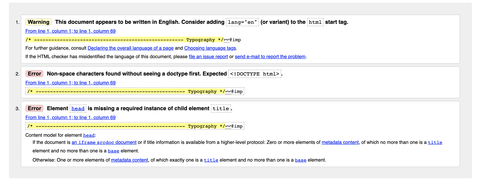

## Table Of Contents
- [Validation](#Validation)
- [Testing User Stories From UX Section](#Testing-User-Stories-From-UX-Section)
    - [Viewing and Navigation](#Viewing-and-Navigation)
    - [Registration and User Accounts](#Registration-and-User-Accounts)
    - [Sorting and Searching](#Sorting-and-Searching)
    - [Purchasing and Checkout](#Purchasing-and-Checkout)
    - [Admin](#Admin)
- [Further Testing](#Further-Testing)
- [Compatibility Testing](#Compatibility-Testing)
    - [Testing with different Broswers](#Testing-with-different-Broswers)
    - [Testing With Different Devices](#Testing-With-Different-Devices)

## Validation

All of the code from my project was passed through the W3C Markup, W3C CSS, JSHint, and Python validators to ensure that there wasn't any unwanted errors in the code.

* [W3C Markup Validator](https://validator.w3.org/) - After running all of my HTML files through the W3C Markup Validator there were no errors that were of any concern to me. There was certain errors that occured throughout all of the html files but these were down to the Jinja templating and template inheritence therefore these errors can be ignored. 

* Below is an example of some of these errors.
    - 

* [W3C CSS Validator](https://validator.w3.org/#validate_by_input) - After running my CSS fiules through the W3C CSS Validator the errors which can be seen in the image below were returned. These can all be ignored as they are due to the template inheritence which is used throughout my project.
 - 

* [JSHint](https://jshint.com/) - All of the JavaScript files were run through the JSHint validator and no errors were returned. 

* [Python Validator](http://pep8online.com/) - All of my Python files were passed through the PEP8 online check validator. All PEP8 errors have been fixed apart from a few which may be left along as they won't have any impact.
 - [PEP8 Online check](http://pep8online.com/)

## Testing User Stories From UX Section

### Viewing and Navigation
* As a shopper I want to be able to view a list of football shirts so that I can buy my favourite teams home shirt.
    - *When this user arrives at the site, they will be able to select the store from the navbar which will take them to the products page. From there they will be able to filter the products by their favourite team and choose the Home shirt.*

* As a shopper I want to be able to view the details of each individual product so I can see the price, description, images of the product, the sizes available and ratings.
    - *When the user arrives on the site, they will be able to select store from the navbar which will take them to the products page. From there, they will be able to click on any product they desire which will present them with the product info page, which will provide them with the description, price, image, sizes and ratings.*

* As a shopper I want to be able to view the contents of my shopping cart so that I can update or remove items.
 - *When the user adds a product to their shopping cart, they will be presented with a toast message with an overview of the product they have added to their cart and a button which gives them the opportunity to navigate to their cart. Alternatively the user can click the cart icon in the top right of the nav bar at any given moment when they are using the site.*

* As a shopper I want to be able to view the grand total of my cart at all times so that I can avoid delivery costs.
    - *Whilst the user is using the site a summary of their cart grand total can be seen in the top right of the nav bar at all times.*

### Registration and User Accounts
* As a user I want to be able to register for an account so that I can keep track of my order history in my profile.
    - *When the user arrives on the website, they can navigate to the my account button in the top right of the nav bar which gives them the option to either register or login.*

* As a user I would like to recieve a confirmation email so that I can verify my account.
    - *Upon registering the user will recieve a confirmation email to the email address that they signed up with.*

* As a user I would like to be able to save my default delivery information so that I don't have to enter it every time I make a purchase.
    - *When a user has registered for an account they will be able to navigate to their own profile from the navbar. On their profile they will be presented with a form which will enable them to update their default delivery information.*

* As a user I would like to be able to view the news articles as a registered user so that I can add comments.
    - *When a user is logged in, they are able to navigate to the News section from the navbar, where they can view news articles. When they arrive on the page of a news article they are presented with a form which enables them to add a comment. The user is able to update or remove the comment after adding it.

### Sorting and Searching
* As a shopper I want to be able to filter the products so that I can identify the best priced, best rated and by category of my choice.
    - *When the user arrives at the site, they can navigate to the store page via the navbar. From there they will be presented with the products page where they are able to use the first dropdown button from the products page navabar which will enable them to filter by best priced, best rated, and by category of their choice.*

* As a shopper I want to be able to sort the products by team so that I can buy my favourite teams products.
    - *When this user arrives at the site, they will be able to select the store from the navbar which will take them to the products page. From there they will be able to filter the products by their favourite team from the teams dropdown button*

* As a shopper I would like to be able to search by name or description so that I can buy the Arsenal Home Kit.
    - *When this user arrives at the site, they will be able to select the store from the navbar which will take them to the products page. From there they can search any paticular query they want from the search bar at the top right of the page.*

## Purchasing and Checkout
* As a shopper I want to be able to see an overview of my order so that I can ensure that I have the correct items.
    - *When a user has added products to their shopping cart and proceeds to the checkout page. They will be presented with an overview of their order, giving them the last opportunity to make any changes before they make their purchase.*

* As a user I want to see efficient form validation when entering my payment details so that I can be sure that my information is safe.
    - *When the user proceeds to the checkout app to make their purchase they are presented with a form for them to enter their details. There is extensive form validation that has been carefully created through the models.*

* As a shopper I would like to see an overview of my order details so that I can ensure that it has been processed properly.
    - *When the user completes the payment process, they are presented with an order confirmation with a summary of their order details. This information will also be stored in the users profile.*

## Admin
* As the store owner I want to be able to add a product so that I can add new products to the store.
    - *When the store owner is logged into their profile, they are able to select the my account dropdown from the navbar which presents them with an add product button. This takes them to the add product page where they are able to add new products.*

* As the store owner I want to be able to edit and update products so that I can change the prices, images, description and ratings.
    - *When the store owner is logged into their account, they are able to navigate to the products page where they will be able to click on the edit button which will be featured on each product which will take them to the edit product page.*

* As the store owner I want to be able to delete products so that I can remove products that are no longer available.
    - *When the store owner is logged into their account, they are able to navigate to the products page where they will be able to click on the delete button which will be featured on each product and will delete that particular product.*

## Further Testing

* Throughout the development process I used Chromes Developer Tools extensively to test the resposinveness of my site accross all screen sizes.

* I went through the site and manually tested each button and link to ensure that they were all working correctly and linking to the correct places. 

## Compatibility Testing

### Testing with different Broswers

I tested my site on the following broswers to ensure that all users were getting the same experience. 

* Google Chrome
* Mozilla Firefox
* Safari

### Testing With Different Devices

I tested my site on all of the devices which I had access to which were the following.

* Apple Macbook Pro 13"
* Apple Iphone 11
* Apple Ipad
* Apple Ipad Mini

[Return to previous document](/README.md)

