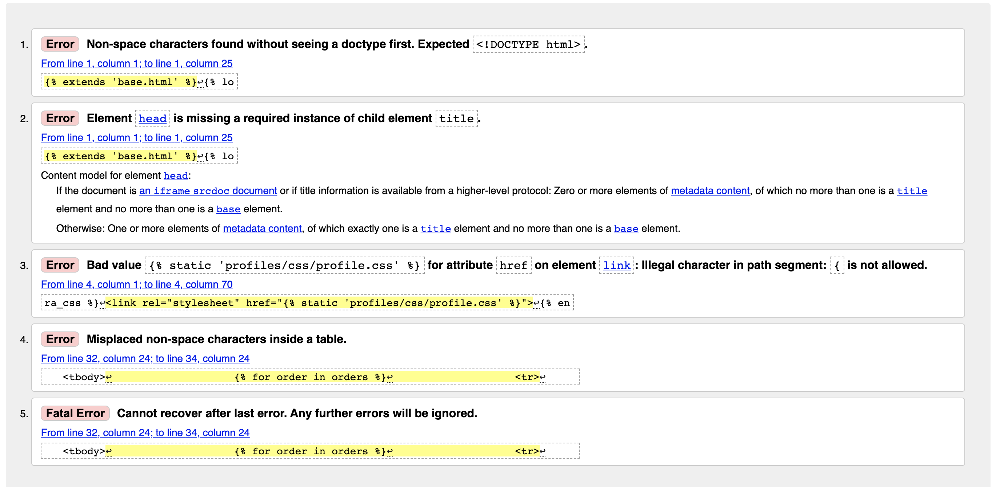

## Validation

All of the code from my project was passed through the W3C Markup, W3C CSS, JSHint, and Python validators to ensure that there wasn't any unwanted errors in the code.

* [W3C Markup Validator](https://validator.w3.org/) - After running all of my HTML files through the W3C Markup Validator there were no errors that were of any concern to me. There was certain errors that occured throughout all of the html files but these were down to the Jinja templating and template inheritence therefore these errors can be ignored. 

* Below is an example of some of these errors.
    - 

* [W3C CSS Validator](https://validator.w3.org/#validate_by_input) - After running my CSS fiules through the W3C CSS Validator the errors which can be seen in the image below were returned. These can all be ignored as they are due to the template inheritence which is used throughout my project.
 - 

* [JSHint](https://jshint.com/) - All of the JavaScript files were run through the JSHint validator and no errors were returned. 

* [Python Validator](http://pep8online.com/) - All of my Python files were passed through the PEP8 online check validator. All PEP8 errors have been fixed apart from a few which may be left along as they won't have any impact.
 - [PEP8 Online check](http://pep8online.com/)

## Testing User Stories From UX Section

### Viewing and Navigation
* As a shopper I want to be able to view a list of football shirts so that I can buy my favourite teams home shirt.
    - ** When this user arrives at the site, they will be able to select the store from the navbar which will take them to the products page. From there they will be able to filter the products by their favourite team and choose the Home shirt. **

* As a shopper I want to be able to view the details of each individual product so I can see the price, description, images of the product, the sizes available and ratings.
    - ** When the user arrives on the site, they will be able to select store from the navbar which will take them to the products page. From there, they will be able to click on any product they desire which will present them with the product info page, which will provide them with the description, price, image, sizes and ratings. **

* As a shopper I want to be able to view the contents of my shopping cart so that I can update or remove items.
 - ** When the user adds a product to their shopping cart, they will be presented with a toast message with an overview of the product they have added to their cart and a button which gives them the opportunity to navigate to their cart. Alternatively the user can click the cart icon in the top right of the nav bar at any given moment when they are using the site. **

* As a shopper I want to be able to view the grand total of my cart at all times so that I can avoid delivery costs.
    - ** Whilst the user is using the site a summary of their cart grand total can be seen in the top right of the nav bar at all times. **

### Registration and User Accounts
* As a user I want to be able to register for an account so that I can keep track of my order history in my profile.
    - ** When the user arrives on the website, they can navigate to the my account button in the top right of the nav bar which gives them the option to either register or login. **

* As a user I would like to recieve a confirmation email so that I can verify my account.

